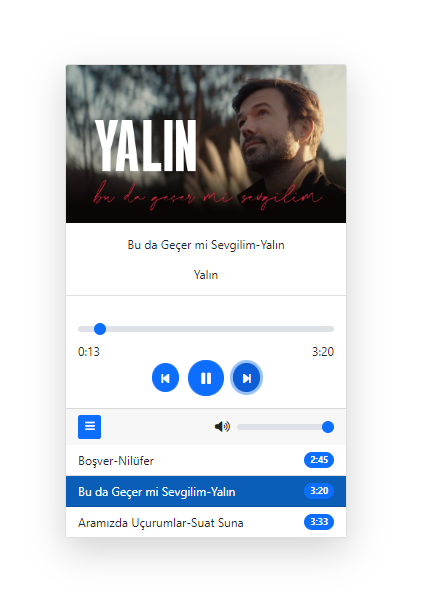

# Music-Player
  
<b><i>OverView</i></b>

In the project, a music application was made in a card. The selected music is marked and the duration information is dynamically retrieved.Volume control is performed and the icon changes when the volume is muted through 'font-awesome' 
   

